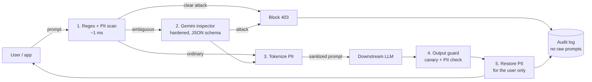

# PromptShield: AI guardrail & prompt-injection firewall

A security proxy between your users and an LLM. Every prompt is screened **before** it reaches the model, and every reply is screened **before** it reaches the user.

**Live app:** _add your deployed URL_ · **Demo login:** `demo@promptshield.dev` / `Demo@1234`

## The problem

Companies are putting LLMs in front of customer data. Three things go wrong: users paste personal data into prompts (it lands in third-party model logs), attackers use prompt injection and jailbreaks to make the model ignore its rules, and models leak system prompts or internal data in replies. Teams also have no audit trail showing what was blocked and why.

## How it works



| Differentiator | Where |
|---|---|
| **Inspector hardening**: random per-request boundary, "untrusted data" system instruction, schema-constrained JSON re-validated with Zod, fail-closed, a dedicated "attack on the firewall" rule | `backend/src/pipeline/inspector.js`, rule `inspector_tamper` |
| **Tiered pipeline with real latency**: Gemini is called only for ambiguous prompts; every stage reports its own milliseconds | `pipeline/index.js`; sandbox + dashboard |
| **Reversible redaction**: `[EMAIL_1]` tokens go to the model, real values are restored in the reply for the user only. The inspector also sees only tokens | `detectors.js` (`tokenize` / `detokenize`) |
| **Output guardrail with canary token**: a hidden marker in the system prompt; if it, or raw PII, shows up in a reply, the reply is withheld or redacted | `outputGuard.js` |
| **Transparency**: each decision stores the matched rules in plain language; "Why this decision?" drawer; CSV/JSON export | Audit log page, `/api/events` |
| **Measured red-team benchmark**: 133 prompts (69 attacks, 54 normal including 40 with attack-like wording, 10 with PII); reports detection, false-positive and PII rates plus latency | Benchmark page, `backend/src/benchmark.js` |
| **Drop-in proxy**: OpenAI-compatible `POST /v1/chat/completions` authenticated with an API key | Integrate page |
| **Enterprise features**: Discord webhook alerts, real-time caching, domain context restriction, SIEM-compatible JSON/CSV exports, model selection, tamper-evident hash-chained audit logs* | `backend/src/pipeline/index.js`, Dashboard |

*\* Note: The hash chain detects edits and truncation by someone who can only modify rows, not an attacker who rewrites the whole database and the head.*

**Privacy by design:** raw prompts and model replies are never written to the database. Only the PII-tokenized prompt is stored.

### Benchmark numbers (built-in suite, regex-only, no Gemini key)

Detection 98.6% (68/69), false positives 0% (0/54), PII redaction 100% (10/10), guardrail p95 under 1 ms.

Read those numbers with care: the rules were tuned with this suite in view, so it measures regressions, not real-world accuracy. A fairer estimate: on 40 prompts written *after* the v1.1 rule rewrite and scored before any further tuning, regex-only caught 12/20 attacks with 4/20 false positives (v1.0 rules: 10/20 and 3/20). Pattern matching has a ceiling, and the Gemini tier is the answer for semantic attacks. **Add your key, re-run the benchmark, and report those numbers.** For a real outside measurement, score against a public labelled set such as `deepset/prompt-injections` or `jackhhao/jailbreak-classification` on Hugging Face.

## Tech stack

React 18 · Vite 7 · React Router 7 · Tailwind CSS 4 · Axios · Recharts · Node.js 22.13+ · Express 5 · JWT · bcryptjs · Zod · SQLite (built into Node, `node:sqlite`) · Google Gemini API (REST; key lives only in backend env vars) · Docker

## Run locally

New here? Follow **[GETTING_STARTED.md](GETTING_STARTED.md)**. Short version (Node 22.13+):

```bash
npm run setup        # creates backend/.env with a random JWT_SECRET, installs both apps
npm run dev          # API on :8080 + UI on :5173 in one terminal; Ctrl+C stops both
npm run test:unit    # no server needed: PII, rules, auth, benchmark floors
npm test             # end-to-end smoke test against the running server
```

CI (`.github/workflows/ci.yml`) runs the build, the unit tests and the smoke test on every push.

Without `GEMINI_API_KEY` the app runs regex-only and the downstream model is a clearly labelled simulation, so you can demo offline. With a key, the inspector and downstream model are real Gemini calls. Check `GEMINI_MODEL` against the models your key can use in Google AI Studio.

## Deploy (one service, simplest)

1. Push this repo to a public GitHub repository.
2. On [Render](https://render.com): **New → Blueprint**, select the repo (it reads `render.yaml`). Or **New → Web Service** with build command `npm run build` and start command `npm start`.
3. In the service's Environment tab add `GEMINI_API_KEY`. `JWT_SECRET` is generated for you. Optionally set `WEBHOOK_URL` (Discord), `UPSTREAM_BASE_URL` (e.g., `https://api.openai.com/v1`) and `UPSTREAM_API_KEY` for proxy forwarding.
4. Open the URL. The demo account and sample history are seeded on every boot.

Render's free tier sleeps when idle (open the URL once before judging) and its disk is ephemeral, so accounts registered by visitors reset on redeploy; the demo account is re-seeded. For persistence, attach a disk and set `DB_PATH` to it.

### Alternative: Vercel frontend + Render backend

Deploy `backend` as a Render web service (root directory `backend`, build `npm install`, start `npm start`) with `CORS_ORIGIN=https://your-app.vercel.app`. Deploy `frontend` on Vercel (Vite preset) with `VITE_API_URL=https://your-api.onrender.com`. `vercel.json` handles SPA routing.

## API

| Method | Path | Notes |
|---|---|---|
| POST | `/api/auth/register`, `/api/auth/login` | Zod-validated, bcrypt-hashed, returns a JWT |
| POST | `/api/chat` | `{prompt, guardrails}`; 403 when blocked |
| POST | `/v1/chat/completions` | OpenAI-compatible; Bearer JWT or `ps_` API key |
| GET | `/api/events`, `/api/events/:id`, `/api/events/export?format=csv\|json` | audit log |
| GET | `/api/stats` | dashboard data |
| GET / PUT | `/api/policy` | per-user policy |
| POST / GET | `/api/benchmark`, `/api/benchmark/latest` | red-team suite |

## Limitations

Pattern rules can be evaded by novel phrasing, and the Gemini tier reduces but does not eliminate that. PII detection is pattern-based (email, phone, SSN, Luhn-checked cards, Aadhaar, PAN, API keys) and misses names and addresses. The canary only catches verbatim leaks. This is defense in depth, not a guarantee.

## Changelog

See [CHANGELOG.md](CHANGELOG.md).
